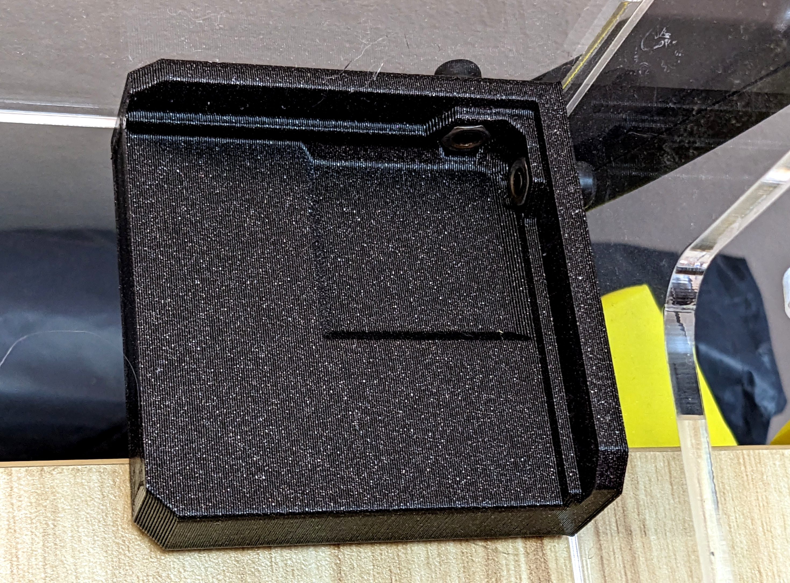
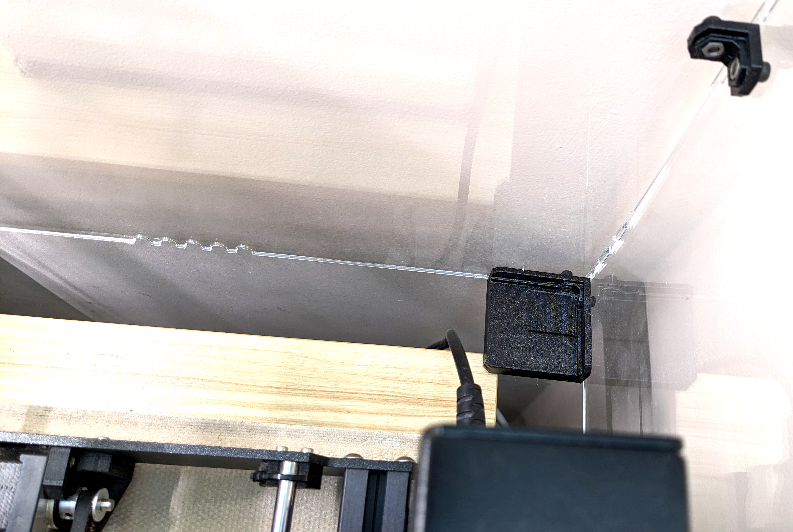
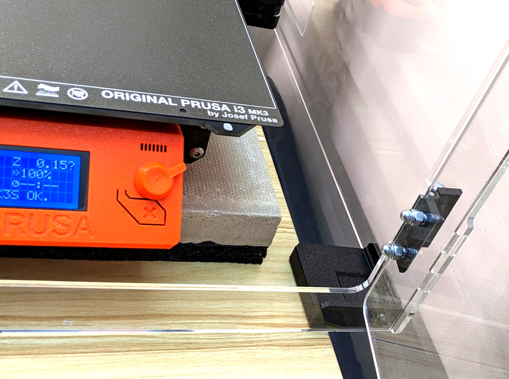
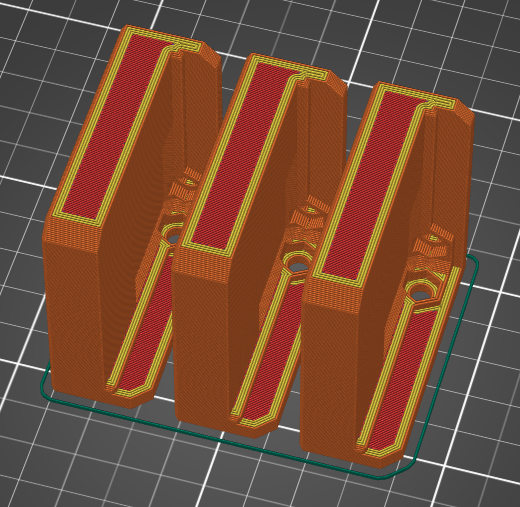
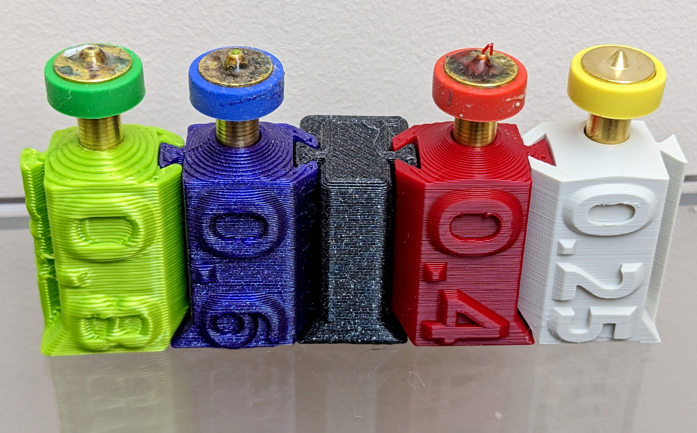
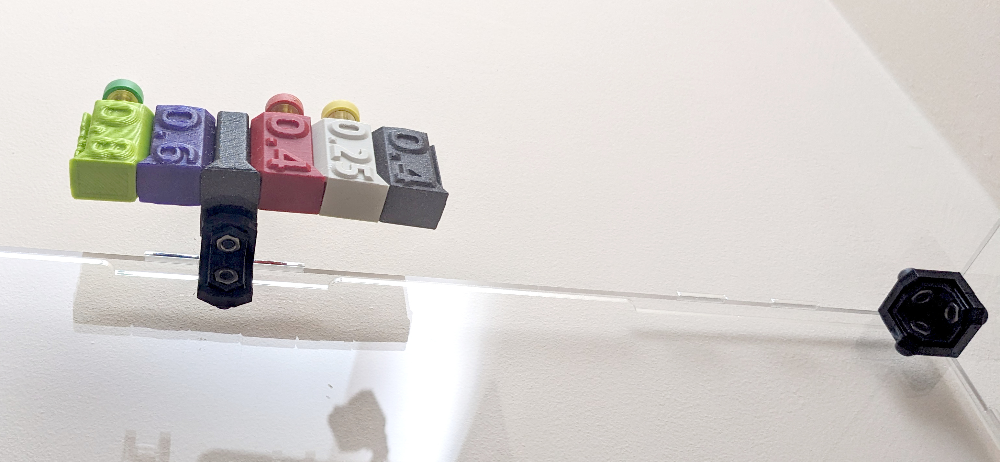

# tukkari-hacks
This repository contains the 3D design files for a modification to the original Tukkari TS printable parts. 

# Enlarged Feet for Tukkari TS 3D printer enclosure

The enlarged feet design allows the enclosure to hang slightly off the edge of a desk, providing a space-saving solution while maintaining stability. It's a modification of original printable feet designed to improve the original feet by increasing their size and adding a slight overhang feature. This design allows to better utilize limited desk space while ensuring the enclosure remains stable and secure.

## Printing instructions

Print with the designed orientation. I believe the orientation provided gives the best reliability. 

### Materials

Tested with PLA. Other filament types should work too.

### Printing Settings

- Nozzle size: 0.6mm, however 0.4mm should also work fine
- Layer Height: 0.3mm for 0.6 nozzle, 0.2mm for 0.4 nozzle
- Perimeters: 4 or more
- Solid layers: 5 or more
- Infill: 30%
- Supports: Not required
- Rafts: Not required

### Installation

1. Remove the original feet from the Tukkari TS 3D printer enclosure.
2. 3D print the enlarged feet (4 pieces required).
3. Attach the new enlarged feet to the enclosure using the original screws and mounting points.

# Enclosure mount for E3D Revo Connect nozzle holders

Use the bolt head on the top of the enclosure to secure Revo nozzle holders. The model holds to the bolt head, which prevents it from sliding inadvertently. 

## Disclaimer

Use these modifications at your own risk. The creator is not responsible for any damage or injury that may occur as a result of using this modification. Always exercise caution when operating 3D printers and modifying equipment.
